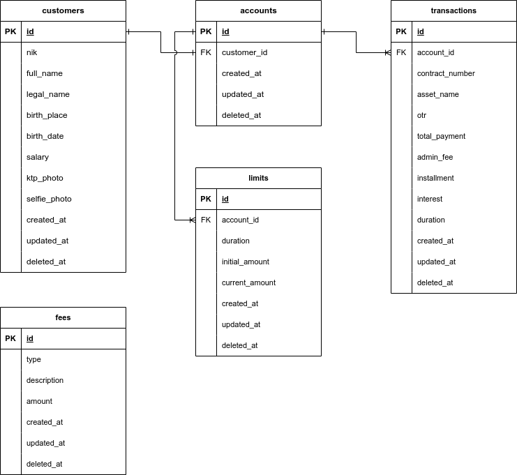
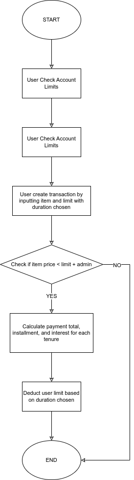

# KP API

## TODO List

- [ ] Add authentication and authorization for account access
- [ ] Implement CRUD management for Admin
- [ ] Implement firebase for storing images
- [ ] Implement full unit testing
- [ ] Add swagger for testing API
- [ ] Implement multi limit logic with percentage, refer: [Tiket.com Paylater Multi Limit](https://www.tiket.com/info/paylater-multi-limit)

## Requirements
- Go >= 1.20
- [Docker](https://docs.docker.com/get-started/get-docker/)
- Docker Compose
- [Goose](https://github.com/pressly/goose) (for database migration)
- [Make](https://www.gnu.org/software/make/#download) (for running scripts)

## App Dependencies

- MySQL >= 5.7
- Goose
- Mockery

## How to Run

Environment variables

```bash
# .env or OS ENV

PORT=8080
DSN=<user>:<pass>@tcp(<host>:<port>)/<database>?charset=utf8mb4&parseTime=True&loc=Local
ENV=development|production
```

Using Docker Compose

```bash
# Build
docker compose build
# or
make build

# Run
docker compose up -d

# Stop and delete volumes
docker compose down -v
```

Manual

> Make sure `docker` is installed for mysql to be running\
> Make sure `goose` is installed for mysql migration
 
```bash
# Run mysql server using credentials admin:admin/database on port 3306
make mysql

# Check migration status
make migrate-status

# Start migration
make migrate-up

# Reset migration
make migrate-reset

# Run api
make run
```

## Database Diagram



## Application Flow




## Architecture

```
├── cmd
│   ├── api
│   └── migration
├── config
├── internal
│   ├── api
│   │   ├── handler
│   │   ├── repository
│   │   ├── router
│   │   └── usecase
│   ├── entity
│   └── model
├── migrations
├── mocks
├── pkg
│   ├── constant
│   ├── datasource
│   ├── exception
│   ├── helper
│   ├── logger
│   └── validation
└── test

```

### CMD
Folder ini berisi file `main.go` yang dapat dibuild menjadi executable sebagai entrypoint Docker.

### Config
package ini digunakan untuk membaca configuration aplikasi seperti **Environment Variables**. Untuk config ini sudah dapat membaca `file .env` dan `ENV OS`.

### Internal
Folder ini berisi core applikasi yang terdiri dari `api`, `entity`, dan `model`.

#### API
Package ini berisi handler, repository, router, dan usecase.

- Handler -> atau bisa dibilang controller sebagai entrypoint dari http API.
- Repository -> sebagai DTO dari Database ke API.
- Usecase -> berisi business logic untuk mengolah data yang diterima dari repository.

#### Entity
Package ini berisi model yang digunakan oleh DTO yang memiliki struktur 1:1 dengan database schema.

#### Model
Package ini berisi model yang digunakan sebagai request dan response dari HTTP.

#### Router
Package ini berisi konfigurasi HTTP Router (Echo) yang digunakan oleh API.

### Migrations
Folder ini berisi file sql yang digunakan proses migrasi database.

### Mocks
Folder ini merupakan hasil generate dari library mockery untuk membuat `mocks` dalam proses testing.

### Pkg
Pkg sendiri merupakan folder yang berisi utilitas dan singleton yang dapat digunakan berulang kali seperti **database instance**, **logger**, **validator**, hingga **helper functions**.